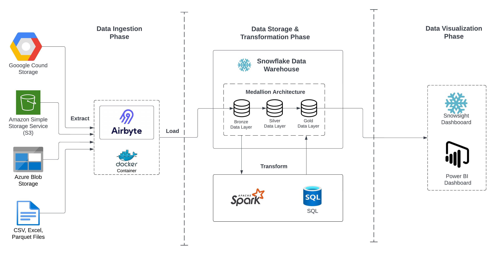
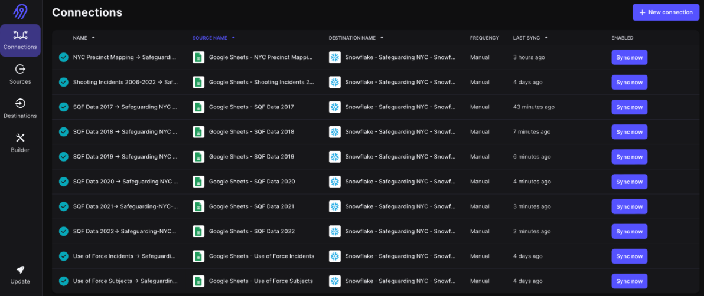
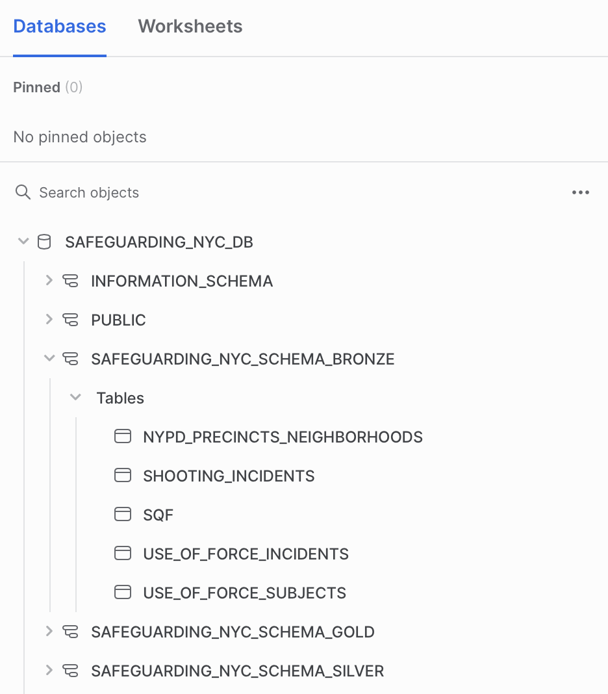
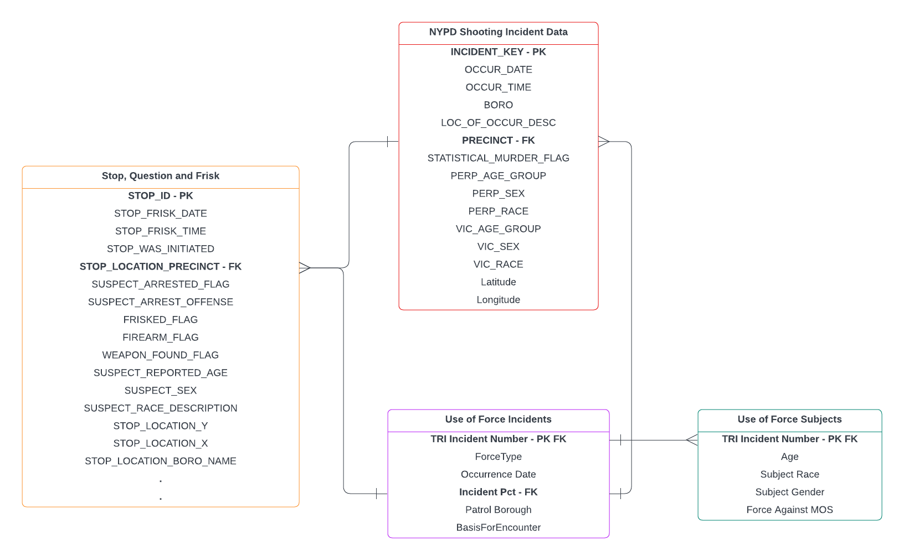

## Safeguarding NYC: Analyzing Crime Patterns using Big Data

### Objective
To provide an in-depth and integrated analysis of crime data from multiple sources in New York City. This study aims to identify patterns, intensities, and distributions of crimes, with the ultimate goal of aiding various stakeholders in understanding and mitigating criminal activities in NYC.

### Demo
<iframe width="560" height="315" src="https://www.youtube.com/embed/h9XeFN8BQqk?si=IZfIL2-SmewLkFOT" title="YouTube video player" frameborder="0" allow="accelerometer; autoplay; clipboard-write; encrypted-media; gyroscope; picture-in-picture; web-share" allowfullscreen></iframe>

https://github.com/complexorganizations/wireguard-manager/assets/102563715/dd539835-2c30-4146-b4f8-940329aa6070


### Setup
1. Create an account on Airbyte [1] or setup and launch Airbyte locally [2] to avoid billing!

2. Store the datasets mentioned below under Data Sources section on any of the cloud platforms like Azure, AWS, GCP. You can also store it locally on your google drive to avoid cloud storage costs!

3. Setup Airbyte 'Connections' to ingest your data. Provided are the references to ingest your data from few of the data sources:
    - Google Sheets: [3.1]
    - Azure Blob Storage: [3.2]
    - AWS CloudTrail: [3.3]
    - Snowflake: [3.4]

4. Create an account on Snowflake [4]

5. Create a warehouse of your choice and get your account, user, role, warehouse and database information

6. Use your snowflake credentials to setup the destination data warehouse for your data ingestion pipeline [5]

7. Once, the Airbyte and Snowflake setup is complete, sync your source data using Airbyte into Snowflake [6]. This will load your entire data into your Snowflake database.

8. Check Snowflake to find your ingested data. If you have your data on Snowflake, then in the helpers/snowflake_config.json file, update your Snowflake Credentials.
    ```json
    {
        "account": "<account>",
        "user": "<user_name>",
        "password": "<password>",
        "role" :"<user_access_role>",
        "warehouse": "<warehouse_name>",  
        "database": "<default_schema_name>"
    }  
    ```

9. You are all set! The Snowflake helper functions will assist you to have a smooth interaction with the Snowflake platform. You can start using the scripts under the 'Bronze to Silver' and 'Silver to Gold' Medallion Layers to perform the transformations.

### Project Architecture



### Data Ingestion using Airbyte



### Snowflake Data Warehouse: Medallion Architecture



### Data
- Data Sources
    1. Stop, Question and Frisk Dataset: https://www.nyc.gov/site/nypd/stats/reports-analysis/stopfrisk.page 
    2. NYPD Shooting Incident Data: https://data.cityofnewyork.us/Public-Safety/NYPD-Shooting-Incident-Data-Historic-/833y-fsy8 
    3. NYPD Use of Force Incidents: https://data.cityofnewyork.us/Public-Safety/NYPD-Use-of-Force-Incidents/f4tj-796d
    4. NYPD Use of Force Subjects: https://data.cityofnewyork.us/Public-Safety/NYPD-Use-of-Force-Subjects/dufe-vxb7/data
    5. NYPD Precincts List: https://www.nyc.gov/site/nypd/bureaus/patrol/precincts-landing.page

- Data Design


- ER Diagram



### References
1. Airbyte (Cloud): https://airbyte.com
2. Airbyte (Local Deployment using Docker): https://docs.airbyte.com/deploying-airbyte/local-deployment
3. Data Source Setup on Airbyte:
    1. Google Sheets: https://docs.airbyte.com/integrations/sources/google-sheets
    2. Azure Blob Storage: https://docs.airbyte.com/integrations/sources/azure-blob-storage
    3. AWS CloudTrail: https://docs.airbyte.com/integrations/sources/aws-cloudtrail
    4. Snowflake: https://docs.airbyte.com/integrations/sources/snowflake
4. Snowflake: https://docs.snowflake.com/en/user-guide-getting-started 
5. Airbyte-Snowflake Destination Setup: https://docs.airbyte.com/integrations/destinations/snowflake 
6. Sync Data to Snowflake using Airbyte: https://airbyte.com/how-to-sync/zencart-to-snowflake-data-cloud